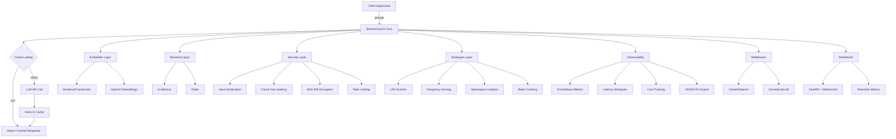
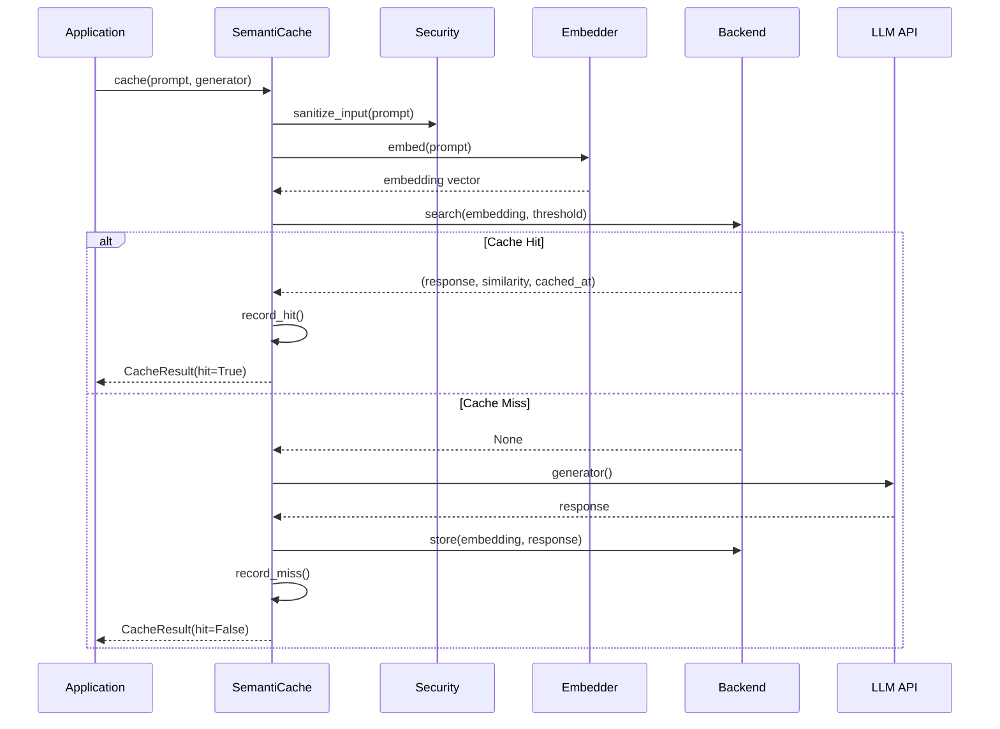

# Architecture

## System Design

SemantiCache is a modular semantic caching middleware for LLMs. The architecture is layered and extensible via pluggable backends, embedders, and strategies.



## Request Flow



## Module Layout

```
semanticache/
├── __init__.py          # Public API exports
├── core.py              # SemantiCache class, CacheResult
├── security.py          # Sanitization, hashing, encryption, rate limiting
├── strategies.py        # LRU eviction, namespaces, batch ops, warming
├── cli.py               # CLI commands (serve, stats, clear, benchmark)
├── backends/
│   ├── __init__.py      # BaseBackend ABC
│   ├── memory.py        # In-memory backend (numpy cosine similarity)
│   └── redis.py         # Redis backend (distributed)
├── embedders/
│   ├── __init__.py      # BaseEmbedder ABC
│   ├── sentence_transformers.py  # Local embeddings
│   └── openai.py        # OpenAI API embeddings
├── middleware/
│   ├── __init__.py      # Middleware exports
│   ├── openai_compat.py # Drop-in OpenAI wrapper
│   └── litellm_compat.py # LiteLLM wrapper
└── utils/
    ├── __init__.py      # Utility exports
    └── metrics.py       # MetricsTracker with Prometheus, histograms, CSV
```

## Key Design Decisions

1. **Async-first**: All backend and embedder operations are async for maximum throughput.
2. **Pluggable backends**: Abstract base classes allow custom storage implementations.
3. **Thread-safe metrics**: `MetricsTracker` uses `threading.Lock` for safe concurrent access.
4. **Namespace isolation**: Cache entries are partitioned by namespace for multi-tenant use.
5. **Lazy initialization**: Embedder models and clients are loaded on first use to minimize startup time.
6. **Security by default**: Input sanitization prevents cache poisoning; optional encryption protects data at rest.
